# 🏎️ Formula 1 Fantasy (Flutter)

Formula 1 Fantasy is a beautifully crafted Flutter application that brings the thrilling world of Formula 1 racing right to your device.  
It’s designed for motorsport enthusiasts who want to **follow their favorite teams and drivers**, **stay updated on the latest and upcoming races**, and even **record personal race notes** — all in one elegant, offline-ready app.

Formula 1, often called the **pinnacle of motorsport**, is a global racing championship featuring cutting-edge technology, elite drivers, and legendary teams like **Ferrari**, **Red Bull Racing**, and **Mercedes**.  
Every race weekend combines **speed, strategy, and innovation** — and this app helps fans experience that energy interactively, whether tracking results, exploring teams, or keeping personal notes on each Grand Prix.

> 🎯 *Mobile-first, offline-capable, and beginner-friendly codebase powered by Provider state management.*

---

## ✨ Features

- 🏁 **Teams list** (current F1 season) with logos, nationality & wiki links
- 👨‍✈️ **Team details** showing drivers fetched dynamically from Ergast API
- 🧠 **Driver details** (name, nationality, code, birthdate, etc.)
- 🗒️ **Race Notes** — add, edit, delete, or browse personal race notes saved locally via SQLite
- ❤️ **Favorites** — mark and persist your favorite teams using SharedPreferences
- 🔐 **Local Sign In / Sign Up** (email stored locally)
- 🕹️ **Offline-first UX** — cached notes and favorites work even without internet
- 🧭 **About F1** — beautiful educational section summarizing F1 eras, cars, and records
- 💡 **Modern UI** — dark theme with authentic F1-style design and typography

---

## 🧱 Architecture (Clean & Practical)

```
lib/
  data/
    models/
      about_f1_model.dart
      driver_model.dart
      notes_model.dart
      race_info_model.dart
      teams_model.dart
    remote/
      f1_api.dart
      teams_api.dart
      drivers_api.dart
    local/
      local_storage.dart      # SharedPreferences (email + favorites)
      notes_db.dart           # SQLite (race notes)
  presentation/
    providers/
      f1_provider.dart
      notes_provider.dart
    screens/
      auth/ (sign_in.dart, sign_up.dart)
      home/ (home.dart, home_screen.dart)
      teams/ (teams.dart, team_details.dart)
      notes/ (notes.dart, add_note.dart)
      favorites/ (favorites.dart)
      about_f1/ (about_f1.dart)
    widgets/
      custom_text_field.dart
      teams_widget.dart
      driver_widget.dart
      race_widget.dart
      notes_widget.dart
      pills_widget.dart
  routes/
    routes.dart
```

---

### 🔄 State Flow

```
Ergast API (via Jolpi)
      ↓
TeamsApi / DriversApi / F1Api
      ↓
Models (fromJson)
      ↓
Providers (ChangeNotifier)
      ↓
UI Widgets (Consumer / Provider.of)
```

---

## 🔌 Data Sources (Free APIs)

- **Ergast (via Jolpi Proxy)** – official F1 historical data  
  🧩 `https://api.jolpi.ca/ergast/f1/current/constructors.json`  
  🧩 `https://api.jolpi.ca/ergast/f1/current/last/results.json`  
  🧩 `https://api.jolpi.ca/ergast/f1/current/next.json`

- **Drivers per Constructor:**  
  `https://api.jolpi.ca/ergast/f1/current/constructors/{constructorId}/drivers.json`

✅ No authentication or API key required.

---

## 🛠️ Tech Stack

| Category | Library |
|-----------|----------|
| Framework | **Flutter (Dart)** |
| State Management | **Provider** |
| Network | **http** |
| Local Storage | **SharedPreferences** |
| Local Database | **sqflite** |
| Assets | **flutter_svg**, PNG, SVG Logos |
| Routing | **Named routes (Routes.dart)** |
| Theme | **Custom dark theme (F1 Red accents)** |

---

## 🚀 Getting Started

```bash
# 1️⃣ Clone this repo
git clone https://github.com/IsaacKamelQadeh/formula1_fantasy_flutter.git
cd formula1_fantasy_flutter

# 2️⃣ Install dependencies
flutter pub get

# 3️⃣ Run the app
flutter run
```

Make sure to have an emulator or connected device ready.

---

## 🧩 Key Local Services

### 🔹 `LocalStorageData` (SharedPreferences)
- Saves user email (local session)
- Persists favorites (team IDs list)

### 🔹 `NotesDB` (SQLite)
- Manages CRUD operations for race notes
- Automatically initializes database on app launch

---

## 💾 Offline-First UX

Even without internet:
- Your **favorites** remain visible (SharedPreferences cache)
- **Race notes** are always accessible (SQLite local DB)
- The app gracefully loads previously fetched team data when possible

This makes it lightweight and usable anywhere — even while traveling or offline.

---

## 📱 UI Highlights

| Screen | Description |
|--------|--------------|
| 🏁 **Teams** | Browse current constructors and view team details |
| 👨‍✈️ **Drivers** | View driver information per constructor |
| 🗒️ **Notes** | Record your own race observations and insights |
| ❤️ **Favorites** | Quickly access your preferred teams |
| 🧠 **About F1** | Learn about F1 history, rules, and iconic moments |

---
## 📸 UI Screenshots

> Dark theme, mobile-first UI — built for F1 fans.  
> Tap any image to view full size.


| Sign In | Sign Up | Home | Home 2 |
|---|---|---|---|
| 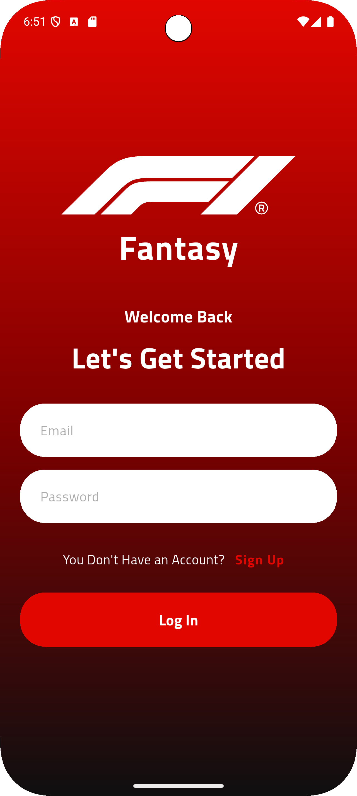 | 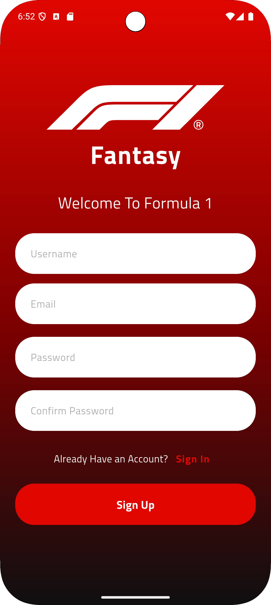  | 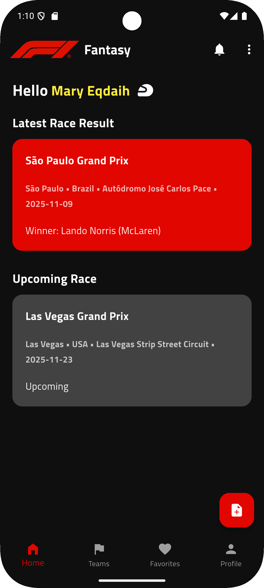 | .png) |
Teams | Team Details | Favorites | About F1 |
|---|---|---|---|
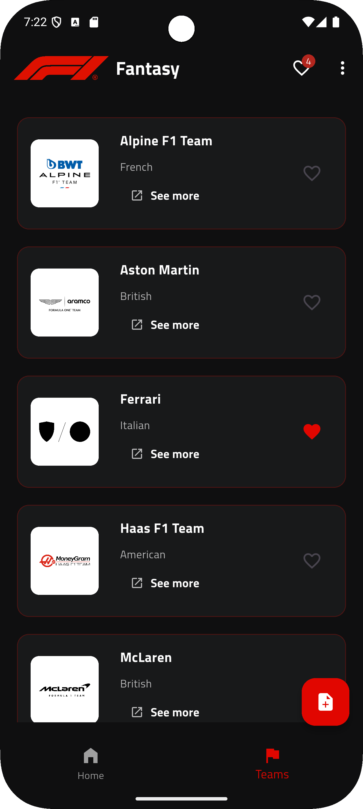 | 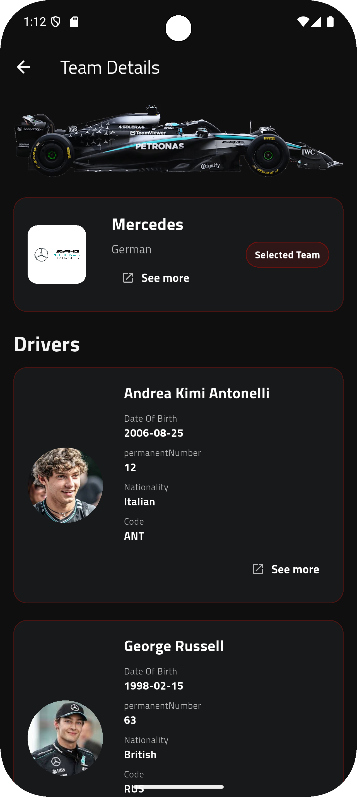 | 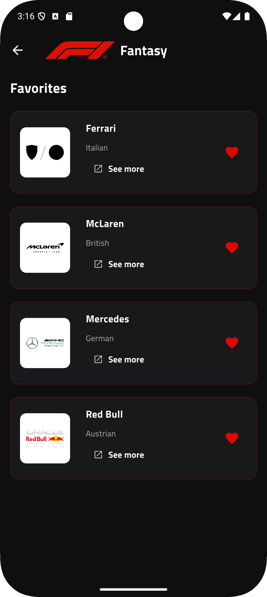 | 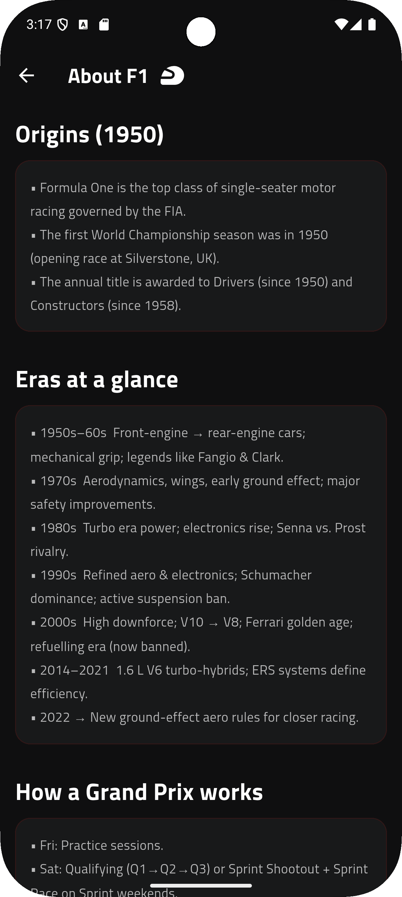 |

| Add Note |Notes List  | Edit Note | Notes After Edit |
|---|---|---|---|
| 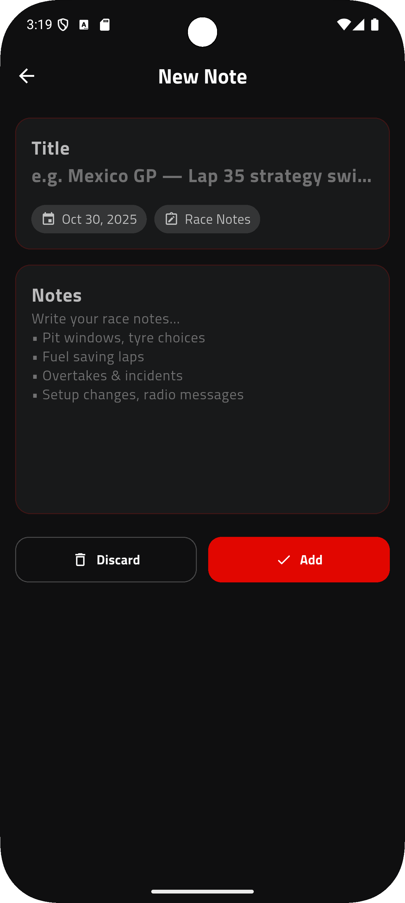 | 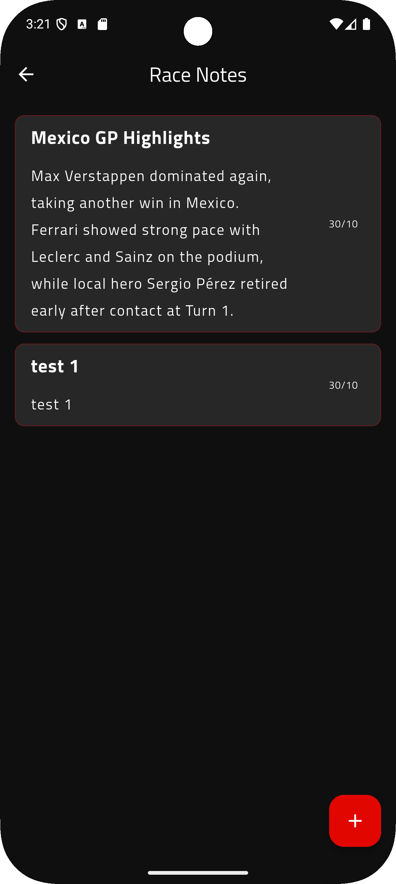 | 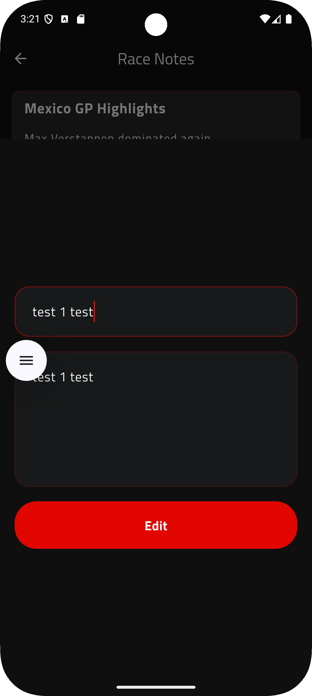 | 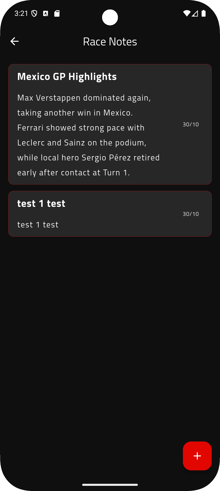 |


---

## 🌍 Why Formula 1?

Formula 1 is not just racing — it’s **engineering, innovation, and precision at 300 km/h**.  
This app was built to make that spirit more interactive, helping fans experience the strategic and technical side of the sport while also giving them tools to take personal race notes, follow teams, and celebrate their passion digitally.

---
## 🙋‍♂️ By

- GitHub: [@Mary-Eqdaih](https://github.com/Mary-eqdaih)

